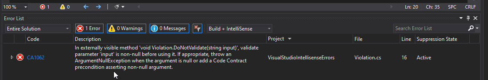

# visual-studio-intellisense-errors
Contains a repro for a problem where Roslyn analyzer warnings are wrongly shown as errors in Visual Studio IntelliSense design-time-build. 

## Problem summary

This repo contains a code sample showing a problem in Visual Studio IntelliSense behavior. The sample contains a class library, which builds just fine when running through the compiler, but Visual Studio displays IntelliSense errors in the Error Windows and in the code with underlined squiggles.

## Detailed repro steps

### Execute the steps

Start Visual Studio 2019/2022 and execute the following steps:

1. Clone this repo
3. Open the ``src\RoslynIntellisenseErrorsRepro.sln`` solution
4. Build the solution
5. Close and reopen the solution
6. Open the ``\src\VisualStudioIntellisenseErrors\FxCopRules\CA1062\Violation.cs`` file
7. Open the ``Visual Studio ErrorList``
8. Change the issue filter to show ``Build + IntelliSense``

__Important:__ It is required to reopen Visual Studio after the repo was cloned and the solution build for the first time (including first package restore)

### Observe the problem

Once the IntelliSense has completed its initialization the ErrorList will show one detected issue for the rule CA1062 as ``Error`` 

despite the ruleset configuration sets its severity to ``Warning`` and the project property ``TreatWarningsAsErrors`` configured as ``<TreatWarningsAsErrors>false</TreatWarningsAsErrors>``:



### Steps to create the sample app from scratch
__General preparation steps:__

1. Install .NET Framework 4.8 SDK
1. Use a latest version of the Visual Studio 2019/2022 (for version details see separate section below)
1. Create a new project using the __Windows Class Library (.NET Framework)__ template
1. Add Analyzer package ``Microsoft.CodeAnalysis.NetAnalyzers, 6.0.0`` ([nuget.org](https://www.nuget.org/packages/Microsoft.CodeAnalysis.NetAnalyzers/6.0.0))
1. Create a new ruleset file configured with e.g. rule ``CA1062`` set to ``Warning`` (see [default.ruleset](src/default.ruleset)). The configuration of all the other rules from the same NuGet Analyzer package does not matter for the purpose of this repro.
1. Add code which violates against the ``CA1062`` rule (see [Violation.cs](src/VisualStudioIntellisenseErrors/FxCopRules/CA1062/Violation.cs)).

__Special preparation steps required to reveal the problem:__

1. Create [build\default.props](build/default.props) containing the following properties:

```xml
  <PropertyGroup>
    <TreatWarningsAsErrors>true</TreatWarningsAsErrors>
    <WarningsNotAsErrors>612,618</WarningsNotAsErrors>
  </PropertyGroup>
```

2. Add the following properties to the [project file](src/VisualStudioIntellisenseErrors/VisualStudioIntellisenseErrors.csproj):

```xml
  <Import Project="..\..\build\default.props" />
  <PropertyGroup>
    <CodeAnalysisRuleSet>..\default.ruleset</CodeAnalysisRuleSet>
    <TreatWarningsAsErrors>false</TreatWarningsAsErrors>
  </PropertyGroup>
```

## Tested with Visual Studio versions

```text

Microsoft Visual Studio Enterprise 2019
Version 16.11.7
VisualStudio.16.Release/16.11.7+31911.196
Microsoft .NET Framework
Version 4.8.03752

Installed Version: Enterprise

```

```text

Microsoft Visual Studio Enterprise 2022
Version 17.0.2
VisualStudio.17.Release/17.0.2+31919.166
Microsoft .NET Framework
Version 4.8.03752

Installed Version: Enterprise

```
